# 서버

### Web Server(HTTP Server)
> 테이크아웃 전문 식당   
> 손님이 받아서 떠마녀 그 이후론 연락이 끊긴다   
> 질의/응답 형태
> * 드물게 정보를 요청/갱신한다
> * 실시간 Interaction이 필요없다
> * 식당에서 손님한테 먼저 접근할 일은 없다
> * 주문 후 손님이 바로 떠나면, 손님의 상태를 당분간 잊고 지낸다(Stateless)

Web Server는 단순히 게임에 국한되지 않고 웹 서비스를 만드는데 사용된다
* 구글, 아마존, 네이버 등

처음부터 만드는 경우는 사실상 없고 프레임워크를 하나 골라서 사용한다
* ASP.NET(C#)
* Spring(Java)
* Node JS(Java Script)
* Django, Flask(Python)
* PHP

### Game Server(TCP Server, Binary Server, Stateful Server 등)
> 일반 식당   
> 서빙 직원이 와서 손님에게 물어볼 수도 있고, 손님이 추가 주문을 하기도 하고 실시간 Interaction이 있다.
> * 요청/갱신 횟수가 많다
> * 실시간 Interaction이 필요하다
> * 언제라도 직원이 손님한테 접근 가능해야 한다
> * 손님이 식당에 머무는 동안, 손님의 상태를 보며 최상의 서비스를 제공한다(Stateful)

게임/장르에 따라 요구사항이 다르다
* 최적의 프레임워크라는 것이 존재하기 애매함

|고려할 대상|게임 서버의 유사성|
|----|----|
|손님 한도|최대 동시 접속자|
|한 방에 들어갈 수 있는 손님의 일행 한도|게임 장르 및 채널링|
|직원 역할 구분|게임 로직, 네트워크, DB|
|직원은 몇 명을 둘지?|쓰레드 개수|
|직원 비율|쓰레드 모델|
|주문은 어떻게 받을까?|네트워크 모델|
|손님이 기다릴 수 있는 시간 한도|반응성(FPS, MMORPG)|
|장부 및 결제는 어떻게?|데이터베이스|

***그럼 무엇을 고려해야 할까?***

## 게임서버란
> 온라인상에서 여러 플레이어가 같이 게임을 할 수 있도록 중개해주는 역할
> * 전투, 아이템, 퀘스트, 업적, 인공지능 등 게임상에서 진행하는 콘텐츠를 client에게 service를 제공

# Window IOCP란?
> 윈도우에서 제공하는 비동기 I/O 방법 중에 가장 뛰어난 방법인 non-blocking 프로세스로 최소한의 스레드로 최대 효율을 낼 수 있다고 알려져있다.

## I/O 작업이란?
> input/output 작업의 줄임말로 컴퓨터 및 주변장치에 대하여 데이터를 전송하는 작업
> * ex) File read/write, Socket을 통한 네트워크 전송

### 입출력(I/O)의 수행
> * 모든 입출력 명령은 특권명령
> * 사용자 프로그램은 어떻게 I/O를 하는가?
>
> 시스템 콜(System call)
>   * 사용자 프로그램은 운영체제에게 I/O 요청      
> 
> 1. trap을 사용하여 인터럽트 벡터의 특정 위치로 이동   
> 2. 제어권이 인터럽트 벡터가 가리키는 인터럽트 서비스 루틴으로 이동   
> 3. 올바른 I/O 요청인이 확인 후 I/O 수행   
> 4. I/O 완료 시 제어권을 시스템콜 다음 명령으로 옮김

### 동기식 입출력
* 동기식 입출력은 I/O 요청 후 I/O 작업이 완료된 후에야 제어가 사용자 프로그램에 넘어가는 것을 말한다.
* 프로세스가 I/O 요청시 CPU제어권은 커널로 넘어가게 되며 I/O 처리와 관련된 커널의 함수가 실행된다. 

### 비동기식 입출력
* CPU가 I/O 요청 후 I/O 장치에서 일어나는 작업을 고려하지 않고(I/O의 결과물을 확인하기 전에) CPU가 다른 작업을 실행하는 경우

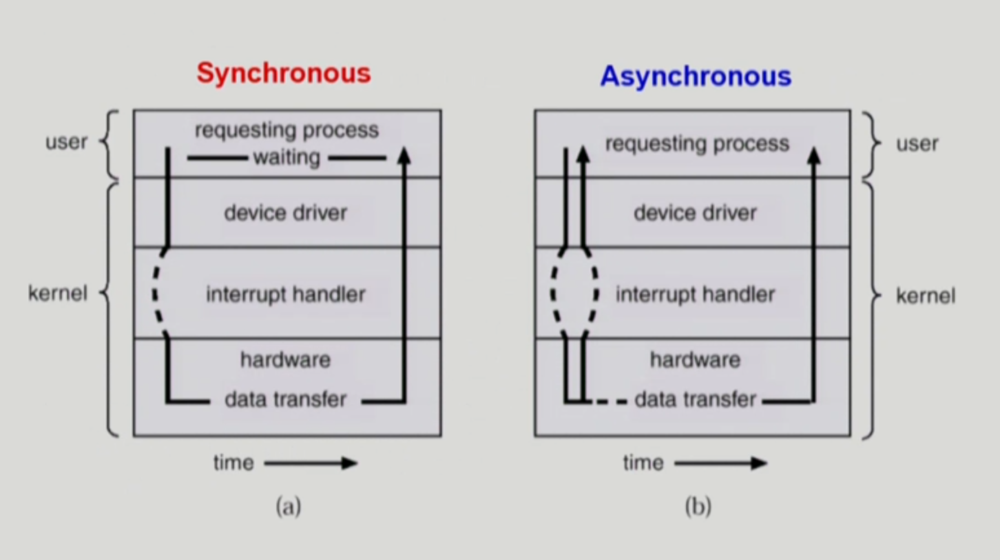 

## Overlapped I/O Model
non-blocking + asynchronous를 응용한 모델
> 9Bytes의 데이터를 전송한다고 가정할 때 3Bytes로 쪼개서 동시에 보내는 방식이다. 9Bytes를 보낼 때 10초가 걸린다고 했을 떄 3Bytes로 3번 동시에 보낸다면 3초가 걸릴 것이다.

* 데이터 전송이 끝날 때 완료했음을 event를 발생시켜 알린다.

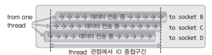 

### 위 그림과 같이 하나의 스레드 내에 동시에 2개 이상의 데이터 전송을 중첩시키는 방법이다.
> 데이터 입력이 완료되면 완료 이벤트를 발생시켜 이벤트를 받은 프로세스는 이벤트 객체 혹은 Completion Routine을 이용하여 데이터를 처리한다/

## IOCP란?
* Input/Output Completion Port의 약자
* Overlapped I/O Model의 확장 모델
> Port는 작업 혹은 서비스를 전담하기 위해 만들어지는 객체이다.
> * 소켓이 포트가 특정 서비스로 데이터 입출력을 전달하기 위한 객체이다

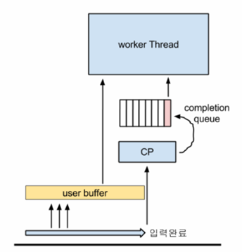 

* 입출력이 완료되면 CP(Completion Queue)에 완료 보고가 쌓인다.
* CP에 완료 보고가 있을 시에 worker thread를 깨워 대기열의 보고를 읽어 데이터를 처리하는 방식이다.

## IOCP 구조체와 함수
* Overlapped I/O 모델의 확장이기 때문에 Overlapped I/O 모델의 구조체와 함수를 사용한다

## IOCP 중요 함수 3가지

### 1. CreateIoCompletionPort()

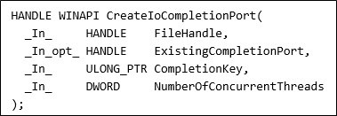 

위 함수는 2가지 용도로 사용된다

### 1. IOCP 커널 객체 생성
> * FileHandle: INVALID_HANDLE_VALUE 전달 -> IOCP handle 생성
> * ExistingCompletionPort: NULL값을 입력
> * CompletionKey: 0 전달
> * NumberOfConcurrentThreads: I/O completion queue를 처리하는 스레드가 동시 수행가능한 수를 입력
> * return 값: 새로 생성된 IOCP handle 리턴

### 2. IOCP와 device 연결
> * FileHandle: IOCP와 연결할 device handle 입력, 비동기 옵션을 주어야 한다.
> * ExistingCompletionPort: FileHandle과 연결할 IOCP Handle 전달
> * CompletionKey: 연결할 디바이스 장비에 고유한 키를 등록, I/O completion queue에 비동기 응답이 온다면 해당 키를 통해서 구분할 수 있다.
> * NumberOfConcurrentThreads: 0 전달(두번 째 매개변수가 NULL이 아니면 무시된다)
> * return 값: 연동된 IOCP handle 리턴, 리턴값이 NULL이라면 GetLastError 함수를 호출하여 에러를 확인합니다.

### 2. GetQueuedCompletionStatus()
IOCP의 I/O completion queue에서 데이터가 입력될 때까지 대기

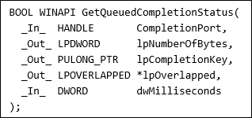 

> * CompletionPort: 완료된 I/O 정보가 등록된 CP Object에 handle 전달
> * IpNumberOfBytesTransferred: 전송된 바이트 크기
> * IpCompletionKey: 완료된 I/O 정보를 가지고 있는 클래스 및 구조체 주소
> * IpOverlapped: WSASend, WSARecv 함수 호출 시 전달할 구조체 주소
> * dwMilliseconds: 대기할 시간(무한 대기 시 INFINITE)

### 3. PostQueuedCompletionStatus()

사용자가 I/O completion queue를 입력한 것 처럼 메세지를 전송

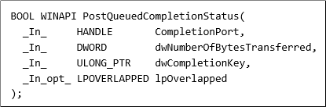 

직접 IOCP Queue에 메세지를 전달하는 함수
> * CompletionPort: 통지할 CP Object handle
> * dwNumberOfBytesTransferrd: 전송할 바이트 크기
> * dwCompletionKey: 전송할 I/O 정보
> * IpOverlapped: 전달할 Overlapped I/O 객체 

## I/O Completion Port Kernel Object

I/O 커널 오브젝트가 생성되면 아래와 같은 5개의 서로 다른 데이터 구조가 생성

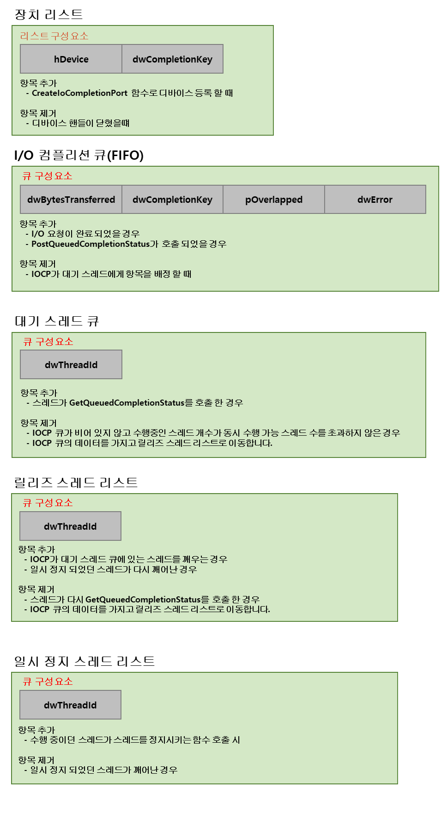 

# IOCP 내부 동작 방식

## IOCP 커널 오브젝트 생성 작업

CreateIoCompletionPort를 사용해서 커널 오브젝트를 생성하고 그림과 같이 IOCP 커널 오브젝트가 생성된다.

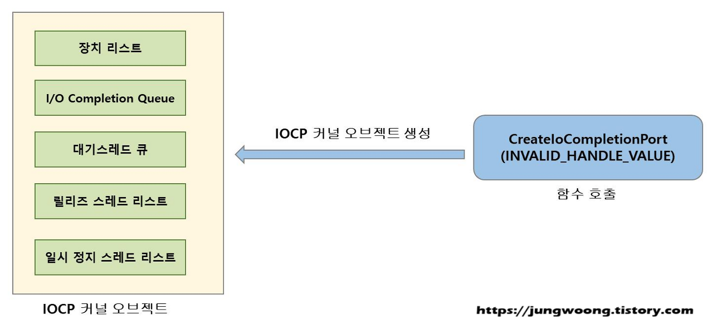 

## IOCP와 디바이스 연결 작업

CreateIoCompletionPort를 사용해서 IOCP와 디바이스를 연동하고 내부적으로는 디바이스 핸들과 completionKey로 항목이 장치 리스트 데이터 구조에 삽입된다.
> 이후에는 연동된 디바이스의 비동기 I/O의 완료통지를 IOCP가 전달 받을 수 있다

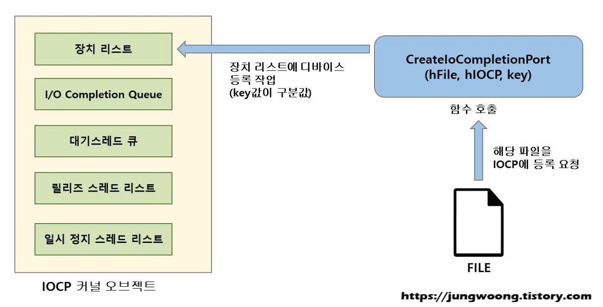 

## GetQueuedCompletionStatus 함수 호출시

 스레드에서 GetQueuedCompletionStatus 함수를 호출했는데 I/O CompletionQueue에 데이터가 없다면 해당 스레드는 대기 상태로 전환되는데 이때에 IOCP 커널 오브젝트의 대기 스레드 큐에 스레드 ID가 추가된다.

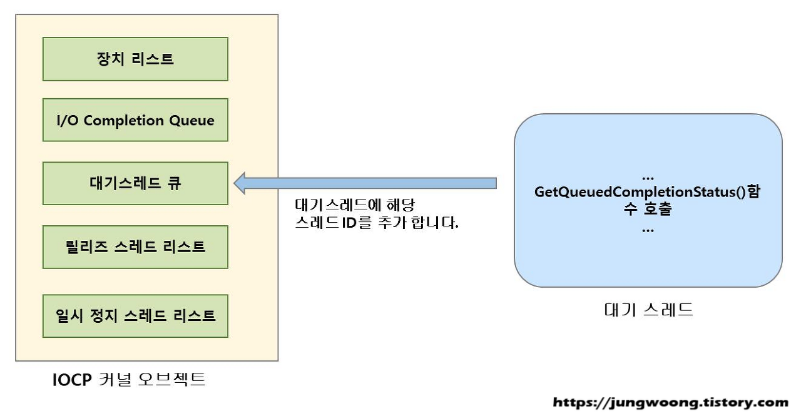 

## 비동기 I/O 작업 완료시 처리

디바이스에 대한 비동기 I/O 요청이 완료되면 시스템은 디바이스와 연계된 IOCP가 있는지 확인한다.
만일 연동된 IOCP가 있다면 완료 통지를 I/O completion queue에 넣어준다.

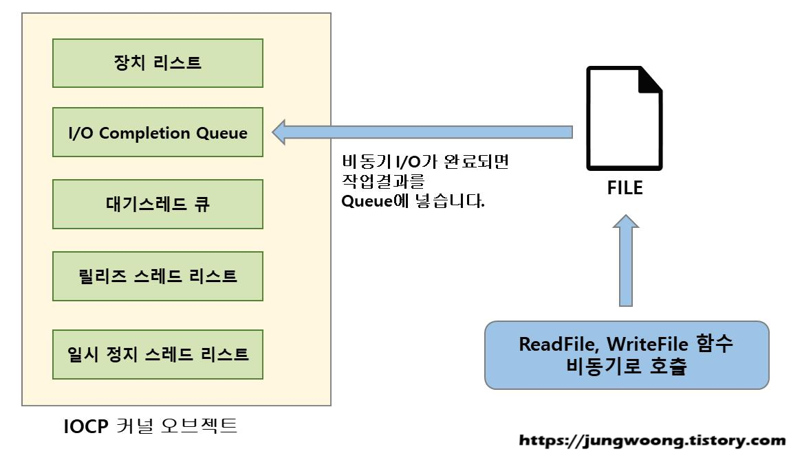 

## I/O Completion Queue 처리 방법

1. I/O Completion Queue에 데이터가 추가되면 대기 스레드 큐를 검사해서 LIFO(Last in First Out) 방식으로 꺠워서 데이터를 처리한다.
2. 깨어난 스레드는 릴리즈 스레드 리스트로 추가된다
> 만약 완료 통지가 자주 발생되지 않는다면 하나의 스레드(Top)를 통해서 모든 통지를 처리 할 수 있다.
> * 다른 스레드의 리소스를 아낄 수 있음(스레드의 메모리를 Swap out, 프로세서의 캐시 지원)

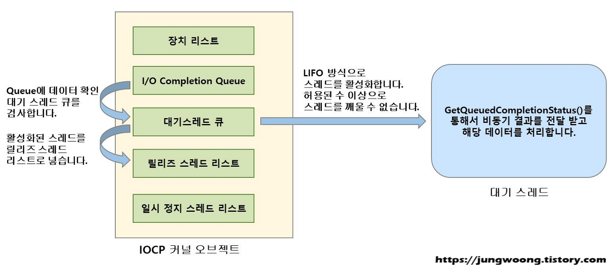 

 ## PostQueuedCompletionStatus 함수 호출시

 I/O Completion Queue에 데이터를 삽입

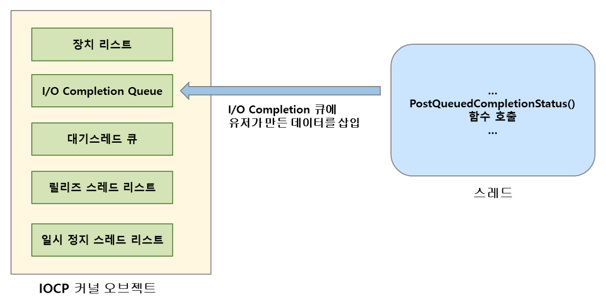 

## 일시 정지 스레드 리스트 관리

릴리즈 스레드 리스트에 등록된 스레드가 수행 중에 대기 상태로 전환되면 IOCP가 감지하여 해당 스레드 ID를 일시 정지 스레드 리스트에 추가하고 릴리즈 스레드 리스트에서 제거한다.   
IOCP는 릴리즈 스레드 리스트의 개수를 동시 수행 가능한 스레드 수만큼 유지 하려고 하기 때문에 대기스레드 큐에서 스레드를 깨워 릴리즈 스레드 리스트로 가져와 수행한다.   
일시 정지된 스레드가 대기 상태에서 다시 수행 상태로 변경되면 다시 릴리즈 스레드 리스트로 옮겨진다.

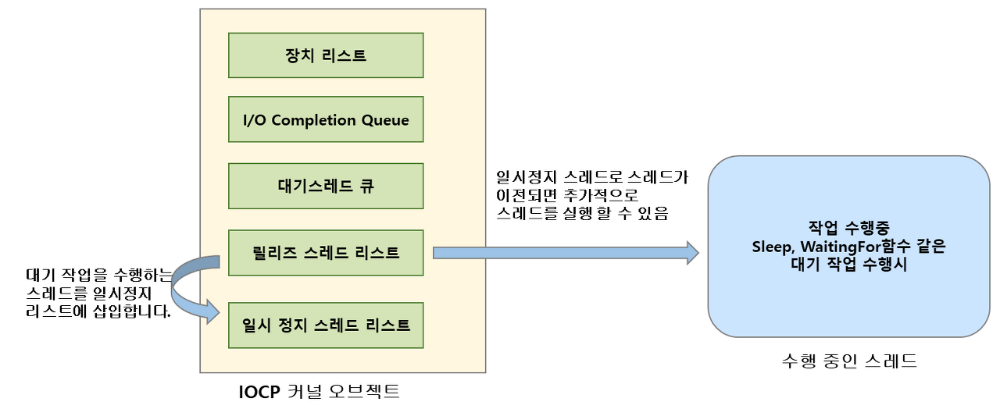 

